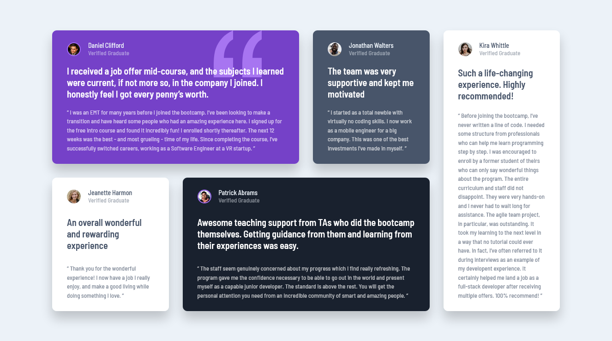

# Frontend Mentor - Testimonials grid section solution

This is a solution to the [Testimonials grid section challenge on Frontend Mentor](https://www.frontendmentor.io/challenges/testimonials-grid-section-Nnw6J7Un7). Frontend Mentor challenges help you improve your coding skills by building realistic projects.

## Table of contents

- [Overview](#overview)
  - [The challenge](#the-challenge)
  - [Screenshot](#screenshot)
  - [Links](#links)
- [My process](#my-process)
  - [Built with](#built-with)
  - [What I learned](#what-i-learned)
  - [Useful resources](#useful-resources)
- [Author](#author)

## Overview

### The challenge

Users should be able to:

- View the optimal layout for the site depending on their device's screen size

### Screenshot

### Links

- Solution URL: [Code](https://github.com/tan911/testimonial-grid-section)
- Live Site URL: [Live site](https://tan911.github.io/testimonial-grid-section/)

## My process

### Built with

- Semantic HTML5 markup
- CSS custom properties
- Flexbox
- CSS Grid
- Mobile-first workflow
- Sass/scss
- BEM (naming)

### What I learned

Using the grid to practice my layout skills

### Useful resources

- [CSS grid](https://css-tricks.com/snippets/css/complete-guide-grid/)

## Author

- Website - [Jovan Lanutan](https://portfolio-tan911.vercel.app/)
- Frontend Mentor - [@tan](https://www.frontendmentor.io/profile/tan911)
